# 🚀 Sistema de Intranet - Comercial Souza


---

## 📝 Descrição

**Contexto:**

Desenvolvimento de uma intranet para a Comercial Souza, visando centralizar a comunicação, otimizar o compartilhamento de documentos e facilitar o acesso a ferramentas essenciais para os colaboradores.

**Ação:**

Criação de uma intranet moderna e responsiva utilizando PHP, MySQL e TailwindCSS. O sistema integra um dashboard dinâmico, repositório de documentos, sistema de sugestões e áreas administrativas.

**Resultado:**

A intranet se estabeleceu como o principal hub de informações, agilizando o acesso a documentos, centralizando comunicados e oferecendo um canal direto para feedback, aprimorando a eficiência e a cultura organizacional.

---

## 🔧 Funcionalidades Principais

- ✅ **Autenticação Segura:** Login e registro com perfis de usuário (colaborador, administrador).
- ✅ **Dashboard Interativo:** Exibição de comunicados, carrossel de imagens e atalhos rápidos.
- ✅ **Gestão de Documentos (Normas e Procedimentos):** Seções dedicadas para PDFs e outros arquivos, incluindo criação de procedimentos padronizados.
- ✅ **Normas e Procedimentos:** Consulta organizada de documentos normativos por setor.
- ✅ **Sistema de Feedback:** Formulário para sugestões/reclamações com painel de gerenciamento para administradores.
- ✅ **Painel Administrativo:** Área restrita para cadastro de informações, gestão de usuários, setores e sistemas.
- ✅ **Notificações em Tempo Real:** Alertas sobre novos procedimentos e atualizações.
- ✅ **Design Responsivo:** Adaptação completa para desktops, tablets e smartphones.

---

## 📁 Estrutura do Projeto

```
intranet/
├── img/                      # Imagens e recursos visuais (logo, background)
├── uploads/                  # Pasta para arquivos enviados pelos usuários
├── vendor/                   # Dependências do Composer (DomPDF, etc)
├── adicionar_funcionario_matriz.php # API para adicionar funcionários na Matriz de Comunicação
├── atualizar_matriz.php      # API para editar a Matriz de Comunicação
├── cadastrar_carrossel.php   # API para adicionar imagens ao carrossel
├── cadastrar_informacao.php  # API para salvar comunicados
├── conexao.php               # Configuração da conexão com o banco de dados
├── get_notificacoes.php      # API para buscar notificações
├── index.php                 # Interface principal da intranet (SPA)
├── login.php                 # Tela de autenticação
├── logout.php                # Script para encerrar a sessão
├── save_procedure.php        # API para salvar novos procedimentos em PDF
├── salvar_sugestao.php       # API para salvar novas sugestões
└── README.md                 # Esta documentação
```

---

## 🛠️ Como Executar (Ambiente Local)

1. Instale o **XAMPP** (ou um ambiente similar com PHP e MySQL).
2. Copie a pasta `intranet/` para o diretório `C:/xampp/htdocs/`.
3. Inicie os módulos **Apache** e **MySQL** no painel de controle do XAMPP.
4. Crie o banco de dados `intranet` no **phpMyAdmin** (`http://localhost/phpmyadmin`).
5. Importe o arquivo `.sql` com a estrutura das tabelas para o banco de dados criado.
6. Acesse a intranet no seu navegador:
    ```
    http://localhost/intranet/
    ```

*Estrutura do Banco de Dados:*  
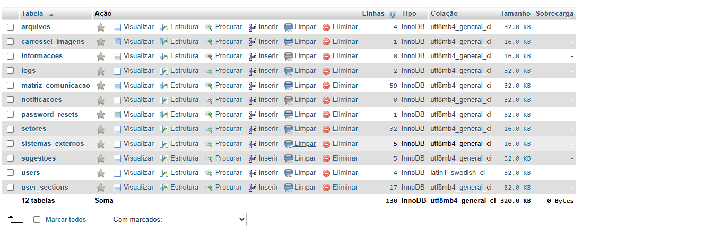

---

## 🔐 Usuários e Permissões

- **Autenticação:** Validação de usuários via tabela `users` no banco de dados `intranet`.
- **Segurança:** Senhas armazenadas de forma segura com `password_hash` do PHP.
- **Sessão:** Dados do usuário (ID, nome, permissão) armazenados na sessão PHP após o login.
- **Níveis de Acesso:** `user`, `admin` e `god`. Administradores possuem acesso a painéis de gerenciamento.

---

## 📸 Capturas de Tela

### 1. ✨ Tela de Boas-Vindas
*A primeira tela que o usuário vê, apresentando a identidade visual e o propósito da intranet.*  
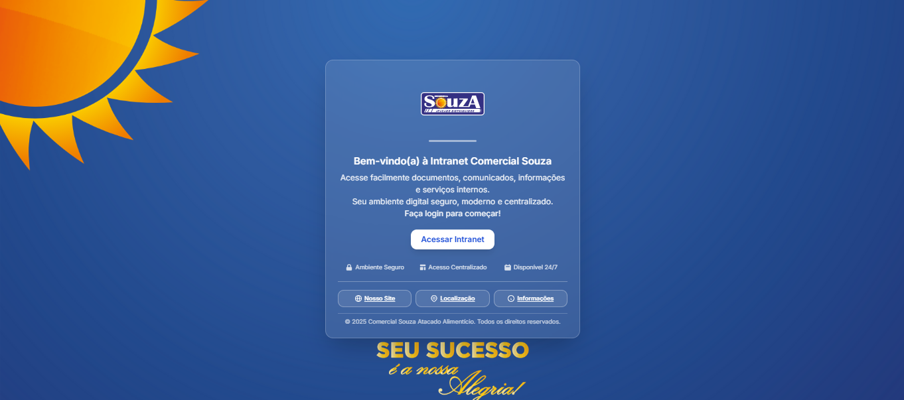

### 2. 🔐 Acesso ao Sistema (Login)
*Modal de login que aparece após clicar em "Acessar Intranet", com campos para usuário e senha.*  
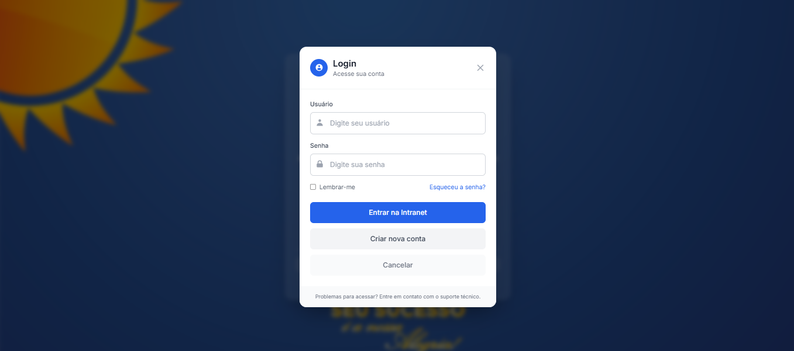

### 3. 🔑 Recuperação de Senha
*Tela para usuários que esqueceram a senha, permitindo a solicitação de um link de redefinição.*  
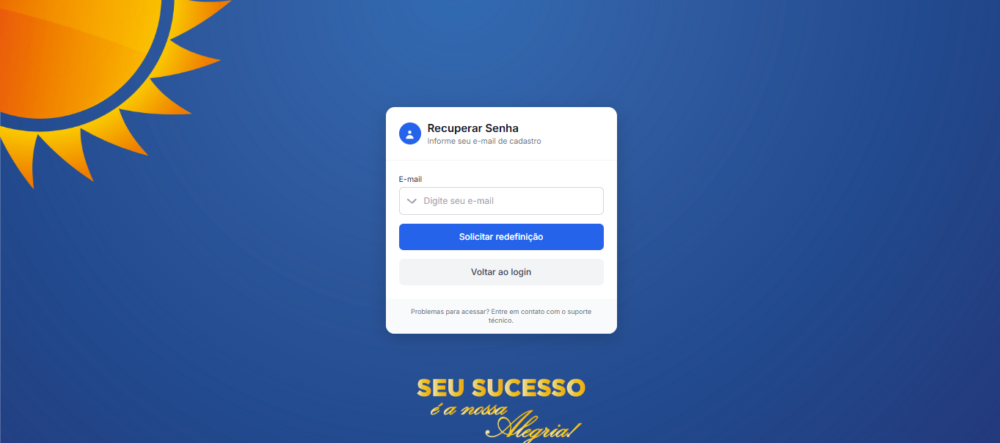

### 4. 🏠 Tela Inicial (Dashboard)
*Visão geral do sistema após o login, com comunicados, carrossel de imagens e atalhos rápidos.*  
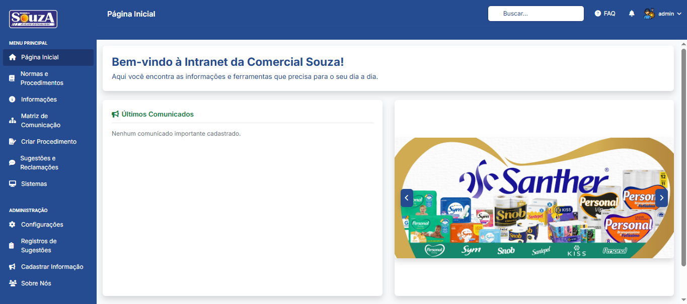

### 5. 📄 Cadastro de Informação
*Formulário para inserção de comunicados e informações no sistema.*  
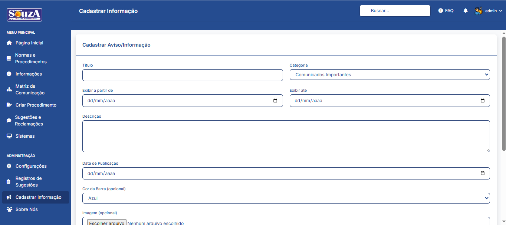

### 6. 📂 Normas e Procedimentos
*Seção para consulta e download de documentos importantes da empresa.*  
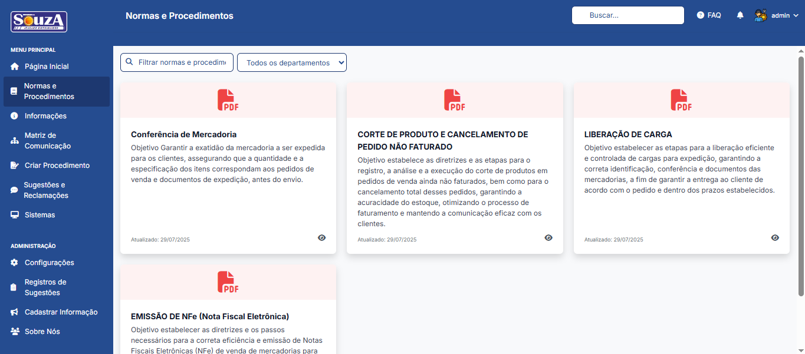

### 7. 📝 Criação de Procedimentos
*Formulário avançado com editor de texto para a criação de novos documentos de procedimento em PDF.*  
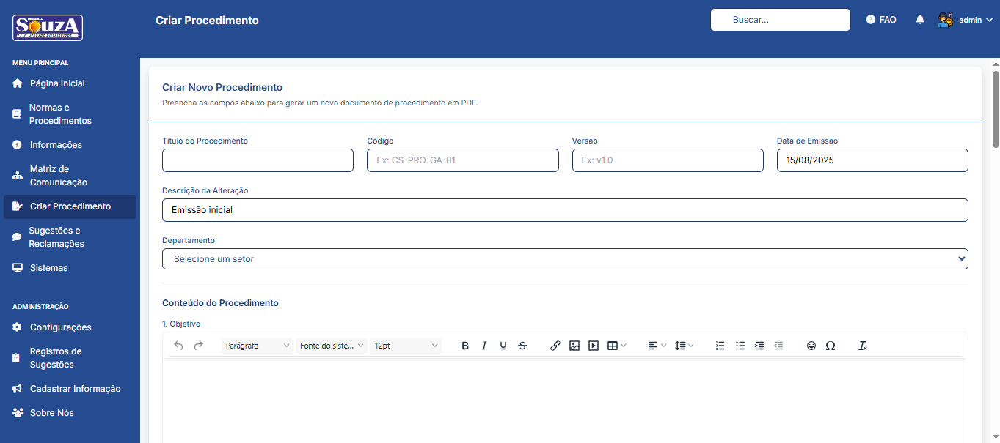

### 8. ❓ FAQ
*Seção com perguntas frequentes e respostas para suporte aos usuários.*  
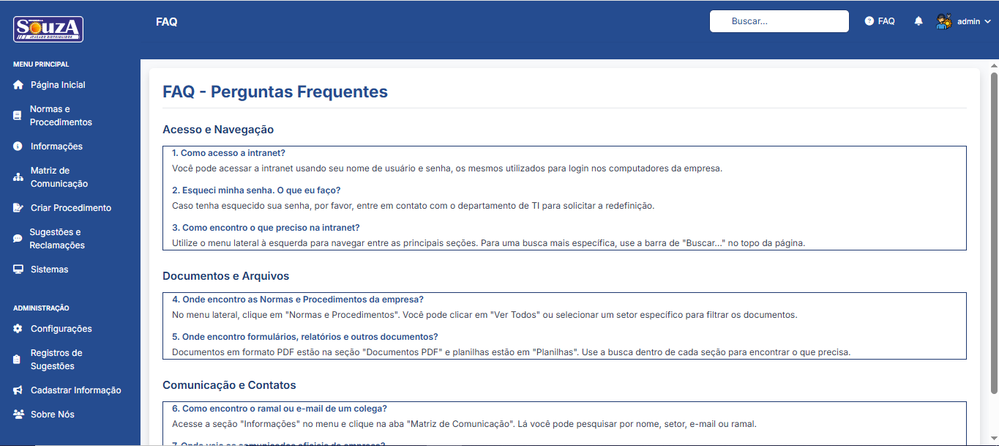

### 9. 📊 Matriz
*Visualização de dados em formato de matriz para análise de comunicação.*  
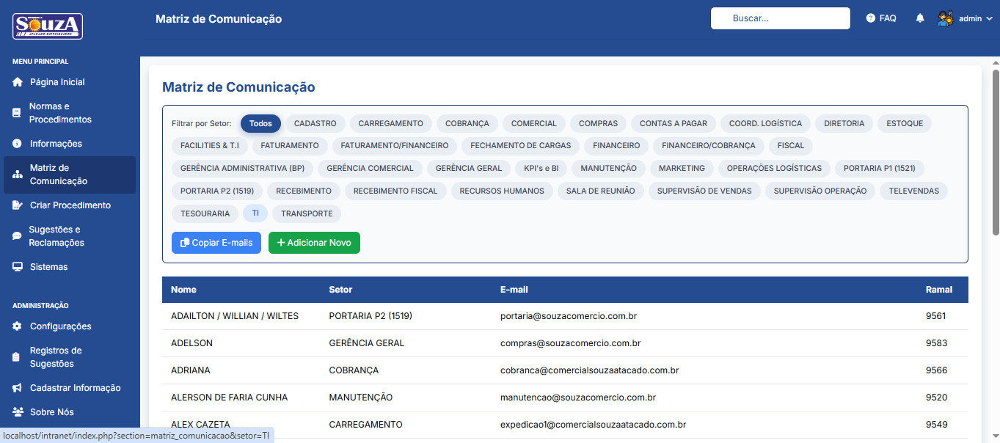

### 10. 🗂️ Registro
*Área para consulta de registros e histórico de atividades.*  
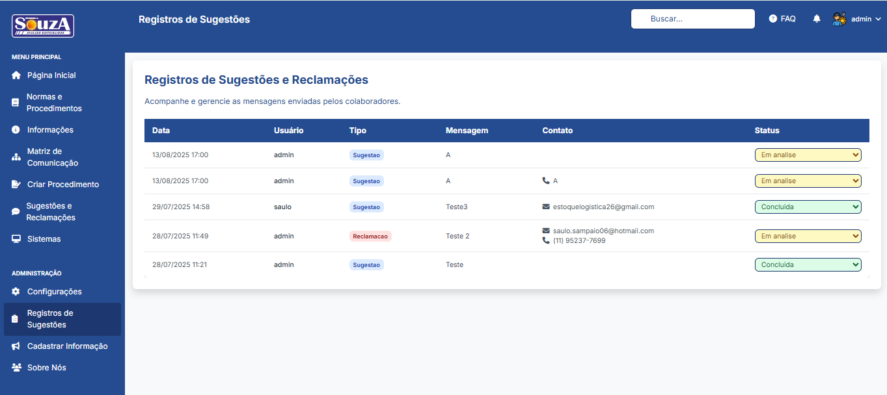

### 11. 💻 Sistemas
*Seção com links e informações sobre sistemas utilizados pela empresa.*  


### 12. 🗣️ Sugestão / Reclamação
*Formulário para envio de sugestões ou reclamações pelos usuários.*  
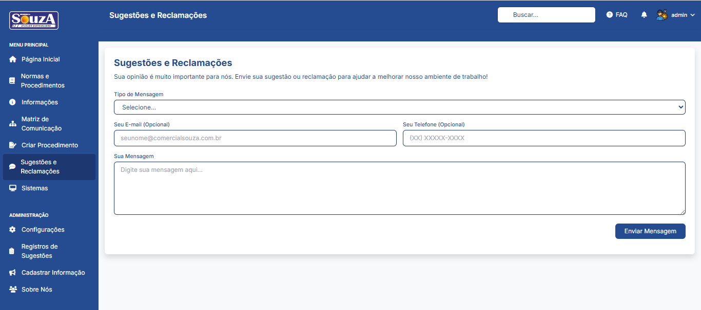

### 13. 📜 Sobre
*Informações sobre o sistema e a empresa.*  
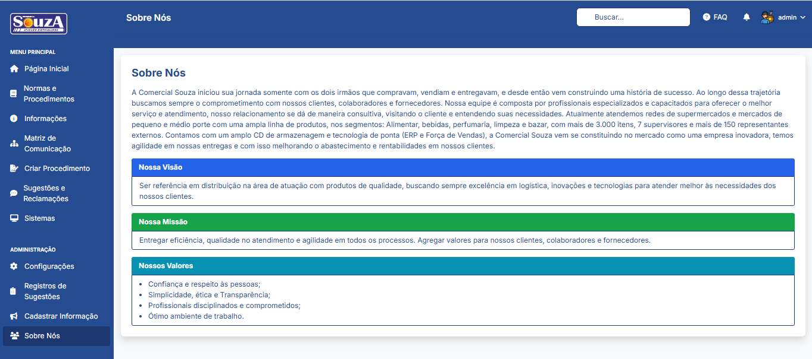

### 14. 👤 Perfil do Usuário
*Página onde o usuário pode alterar sua foto e senha.*  
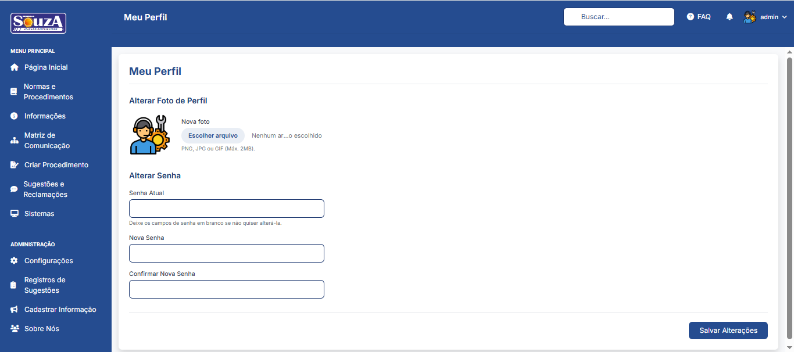

### 15. ⚙️ Configurações e Permissões
*Painel administrativo para gerenciamento de usuários, permissões de acesso e outras configurações do sistema.*  
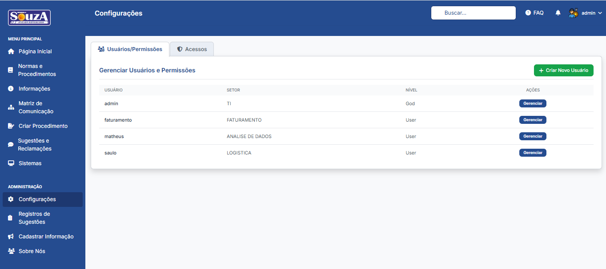

### 16. ⚙️ Configurações (Parte 2)
*Complemento do painel de configurações com opções adicionais.*  
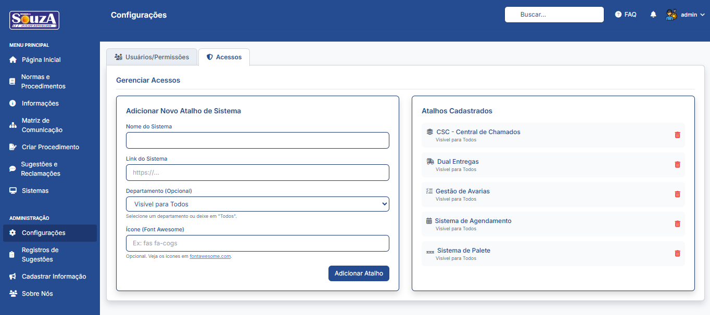

---

## 👨‍💻 Autor

**Saulo Sampaio**  
**Matheus Cabral**

*Sistema desenvolvido para centralizar a comunicação e os recursos da Comercial Souza.*

---

## 📄 Licença

Projeto de uso interno.  
Livre para adaptar conforme a necessidade da empresa.

---