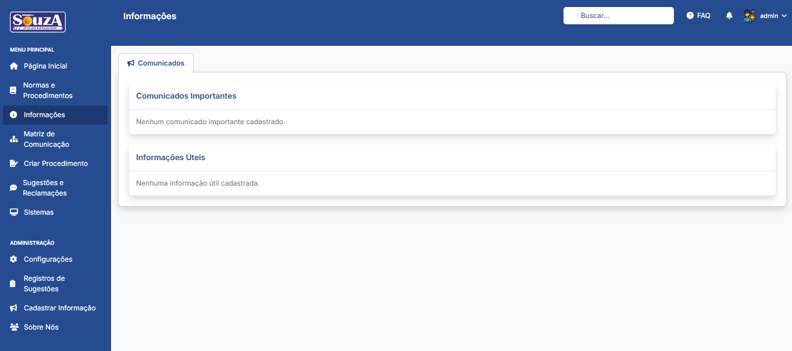

---

## 🛠️ Como Executar (Ambiente Local)

1.  Instale o **XAMPP** (ou um ambiente similar com PHP e MySQL).
2.  Copie a pasta `intranet/` para o diretório `C:/xampp/htdocs/`.
3.  Inicie os módulos **Apache** e **MySQL** no painel de controle do XAMPP.
4.  Crie o banco de dados `intranet` no **phpMyAdmin** (`http://localhost/phpmyadmin`).
5.  Importe o arquivo `.sql` com a estrutura das tabelas para o banco de dados criado.
6.  Acesse a intranet no seu navegador:
    ```
    http://localhost/intranet/
    ```

---

## 🔐 Usuários e Permissões

-   **Autenticação:** Validação de usuários via tabela `users` no banco de dados `intranet`.
-   **Segurança:** Senhas armazenadas de forma segura com `password_hash` do PHP.
-   **Sessão:** Dados do usuário (ID, nome, permissão) armazenados na sessão PHP após o login.
-   **Níveis de Acesso:** `user`, `admin` e `god`. Administradores possuem acesso a painéis de gerenciamento.

---

## 📸 Capturas de Tela

### 1. 📄 Cadastro de Informação


### 2. ⚙️ Configuração


### 3. ⚙️ Configuração (Parte 2)


### 4. 📝 Criar Procedimento


### 5. ❓ FAQ


### 6. ℹ️ Informações


### 7. 🏠 Tela Inicial


### 8. 📊 Matriz


### 9. 📚 Normas e Procedimentos


### 10. 👤 Perfil


### 11. 🗂️ Registro


### 12. 💻 Sistemas


### 13. 📜 Sobre


### 14. 🗣️ Sugestão / Reclamação


---

## 👨‍💻 Autor

**Saulo Sampaio**  
**Matheus Cabral**

*Sistema desenvolvido para centralizar a comunicação e os recursos da Comercial Souza.*

---

## 📄 Licença

Projeto de uso interno.  
Livre para adaptar conforme a necessidade da empresa.
